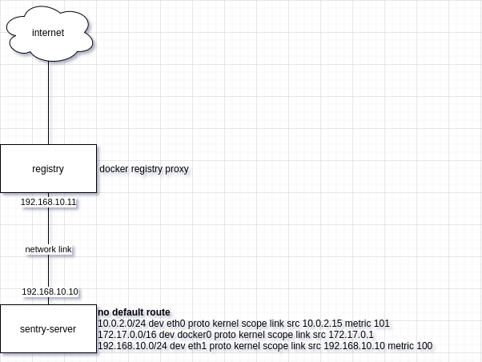

# Install sentry in isolated environment

Based on [this](https://medium.com/@andrenit/docker-and-artifactory-as-a-registry-mirror-1365891b39c5) article

## Problem description

If we have restricted environment with possibility to get any artifacts only from one artifacts registry like Artifactory or simslar, there is some problems to install sentry on-premise from [sentry self-hosted repository](https://github.com/getsentry/onpremise). These problems are:
1. All services from `docker-compose.yml` have their `image:`s named w/o registry name. It supposes that these images will be downloaded from  default docker registry named [docker hub](https://hub.docker.com)
2. Three of services: `snuba-cleanup`, `symbolicator-cleanup` and `sentry-cleanup` are built locally using `./corn` context. One of instructions in `Dockerfile` installs `cron` package from debian repository.

But docker hub and debian package repository are inaccessible from our restricted environment. So below are described some steps to solve these problems.

## Environment

Here is 2 instances:
- `sentry-server` with no access to the internet and already downloaded [sentry self-hosted repository](https://github.com/getsentry/onpremise)
- `registry` with access to the internet and hosting docker registry as docker hub mirror, like described [here](https://docs.docker.com/registry/recipes/mirror/)



## How to up

### Custom docker images

Activate virualenv
```shell
. ./.venv/bin/activate
```
Build custom images for some services. On local machine:
```shell
cd ./docker
# build
docker-compose build
# push to $DOCKER_HUB_USER/ repo (to use yourown, update .env )
docker-compose push
```

### Up environment

First up vagrant environemnt
```shell
vagrant up
```

Then run docker registry proxy by hand (TODO: automate)
```shell
vagrant ssh registry
cd /var/deploy
docker-compose up -d
# and watch logs
docker-compose logs -f
```

### Isolate sentry-server

Get sentry self-hosted repo and remove default route
```shell
ansible-playbook -i .vagrant/provisioners/ansible/inventory/vagrant_ansible_inventory isolate.yml
```

NOTE: If you got an error `WARNING: REMOTE HOST IDENTIFICATION HAS CHANGED!`, remove oraphned ssh host identity
```shell
ssh-keygen -f "/home/vscoder/.ssh/known_hosts" -R "[127.0.0.1]:2222"
```
and then run previous step again

### Try to install sentry

Go to sentry repo directory
```shell
vagrant ssh sentry-server
cd /var/deploy/sentry
```

Add to `.env` variable `DOCKER_HUB_USER` with the same value as in local `./docker/.env`. By default is:
```shell
# Custom variables
DOCKER_HUB_USER=vscoder
```

Update `docker-compose.yml` (or create corresponding `docker-compose.override.yml` [documentation](https://docs.docker.com/compose/extends/)). Set custom images and comment `build` sections for services:
- `snuba-cleanup:`
```yaml
  snuba-cleanup:
    << : *snuba_defaults
    image: $DOCKER_HUB_USER/snuba-cron:test
    #build:
    #  context: ./cron
    #  args:
    #    BASE_IMAGE: '$SNUBA_IMAGE'
    command: '"*/5 * * * * gosu snuba snuba cleanup --dry-run False"'
```
- `symbolicator-cleanup:`
```yaml
  symbolicator-cleanup:
    << : *restart_policy
    image: $DOCKER_HUB_USER/symbolicator-cron:test
    #build:
    #  context: ./cron
    #  args:
    #    BASE_IMAGE: '$SYMBOLICATOR_IMAGE'
    command: '"55 23 * * * gosu symbolicator symbolicator cleanup"'
    volumes:
      - 'sentry-symbolicator:/data'
```
- `sentry-cleanup:`
```yaml
  sentry-cleanup:
    << : *sentry_defaults
    image: $DOCKER_HUB_USER/sentry-cron:test
    #build:
    #  context: ./cron
    #  args:
    #    BASE_IMAGE: 'sentry-onpremise-local'
    command: '"0 0 * * * gosu sentry sentry cleanup --days $SENTRY_EVENT_RETENTION_DAYS"'
```

Install sentry
```shell
./install.sh
```


## TODO

- [ ] Automate up of docker registry (fix `provision.yml`)
- [x] Provide dns configuration on `sentry-server` via `/etc/hosts`
- [x] Configure docker on `sentry-server` to use `registry` as mirror
- [x] Download sentry/onpremise on `sentry-server`
- [x] Disable internet on `sentry-server` (delete default gateway)
- [ ] Provide debian repository proxy
- [ ] Configure `sentry-server` to use debian repository proxy except real one
- [x] Install sentry w/o internet access
